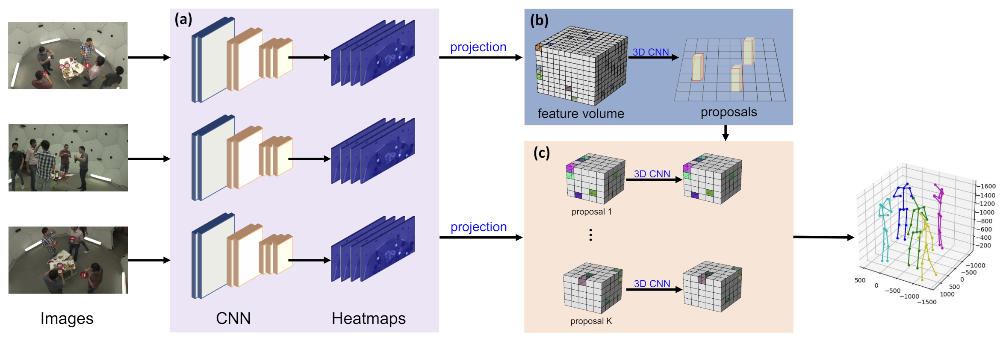
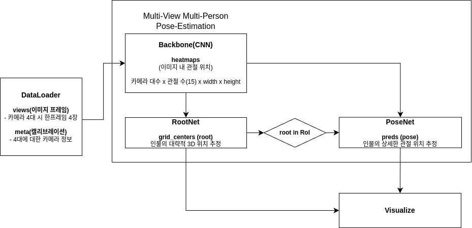

# Selfpose3d UI

## 데모 실행 방법
### requirements.txt
```
pip install -r requirements.txt
```
### quick_setup.py
```
python quick_setup.py
```
### run demo
```
python poc_ui.py
```
또는
```
python run.py
```
로도 실행이 가능합니다.

## 모델 구조 설명



selfpose3d([링크](https://github.com/CAMMA-public/SelfPose3d))는 voxelpose([링크](https://github.com/microsoft/voxelpose-pytorch))의 구조에서 자기지도학습을 도입해 Ground Truth 3D pose가 없어도 학습이 가능한 모델입니다.

추론 단계에서 모델 구조는 크게 3가지 단계로 나뉩니다.
2D heatmap backbone -> 3D root estimation -> 3D pose estimation


1. 같은 시간 상의 카메라 여러대에서 불러온 이미지(views)와 카메라들의 캘리브레이션 정보가 포함된 meta를 입력으로 받습니다. 참조: modules/focus/dataset.py

2. 2D heatmap backbone: 각 카메라 view에서 인물의 관절들의 위치를 독립적으로 찾아 히트맵으로 반환합니다.

3. Root feature volume 생성: 카메라가 촬영하는 공간을 나타내는 3D feature volume을 생성하고 모든 root 히트맵을 투영시킵니다. 모델에서 root는 인물의 골반에 해당하는 부위입니다.

4. Root Estimation: 투영된 feature volume은 각 지점에 사람의 관절이 있을 가능성을 나타내는 값을 가지는 3D 히트맵입니다. 이를 통해 인물의 Root를 추정합니다.

5. Pose feature volume 생성: 각 root 지점을 중심으로 더 작은 구역에 세밀하게 집중하는 Pose feature volume을 생성하고 관절별 히트맵을 투영시킵니다.

6. Pose Estimation: 세밀화된 feature volume을 기반으로 정밀하게 관절들의 위치를 추정합니다. 최종적으로 여러 인물들과 인물들의 관절 좌표 값들을 반환합니다.


## 코드 설명
전체적인 추론과정은 modules/SelfPose3d/lib/models/multi_person_posenet_ssv.py 의 MultiPersonPoseNetSSV 클래스의 forward 함수에서 담당합니다.


```python
class MultiPersonPoseNetSSV(nn.Module):
    def forward(
        self,
        raw_images=None,
        views1=None,
        meta1=None,
        distance=None,
    ):
        all_heatmaps = [] # 1. 2D 히트맵 추론 단계
        for view in views1:
            heatmaps = self.backbone(view)
            all_heatmaps.append(heatmaps)

        device = all_heatmaps[0].device
        batch_size = all_heatmaps[0].shape[0]

        _, _, _, grid_centers = self.root_net(all_heatmaps, meta1) # 2. 3D root 위치 추론 단계

        pred = torch.zeros(batch_size, self.num_cand, self.num_joints, 5, device=device)
        pred[:, :, :, 3:] = grid_centers[:, :, 3:].reshape(batch_size, -1, 1, 2)

        pred_2d = torch.zeros(batch_size, self.num_cand, len(meta1), self.num_joints, 2, device=device)
        crop_face_images = []

        if not isinstance(raw_images, np.ndarray): # (b, cam, h, w, ch)
            raw_images = np.array(raw_images.detach().cpu())

        for n in range(self.num_cand): # root는 곧 인물의 위치를 뜻합니다. root 별로 pose_net을 수행할지 말지 결정합니다.
            index = pred[:, n, 0, 3] >= 0
            if torch.sum(index) > 0:
                if self._cal_distance(grid_centers[:, n, :2], distance) == False: # 3. LoD 설정을 위해 root 위치와 distance 값을 비교해 pose_net을 수행할지 결정합니다.
                    grid_centers[:, n, 3] = 1
                    pred[:, n, :, 3] = 1
                    continue
                single_pose = self.pose_net(all_heatmaps, meta1, grid_centers[:, n]) # 4. 조건을 만족하면 pose_net을 통해 pose를 추정합니다.
                if min(single_pose[:,8,2], single_pose[:,14,2]) < 0 or min(single_pose[:,8,2], single_pose[:,14,2]) > 120:
                    grid_centers[:, n, 3] = -1
                    pred[:, n, :, 3] = -1
                    continue
                pred_2d[:, n, :, :, :] = self._2d_projection(single_pose, meta1)
                crop_face_images.append(self._crop_face_images(raw_images, pred_2d[:, n, :, :]))

                pred[:, n, :, 0:3] = single_pose.detach()
                del single_pose

        return pred, pred_2d, all_heatmaps, grid_centers, crop_face_images
```

### backbone
```python
all_heatmaps = [] # 1. 2D 히트맵 추론 단계
for view in views1:
    heatmaps = self.backbone(view)
    all_heatmaps.append(heatmaps)
```
